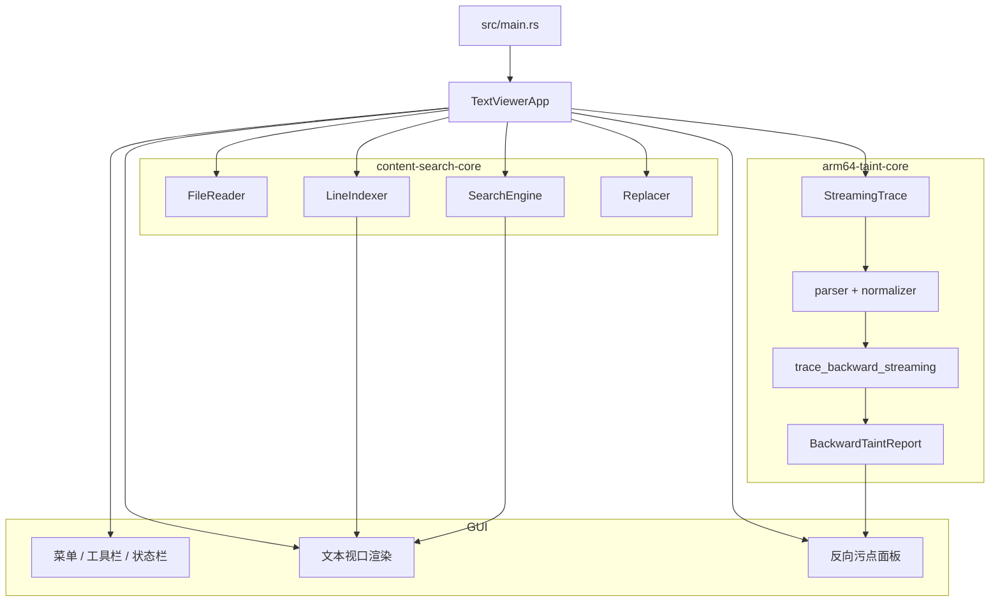

# Taint-Rev-Trace

`Taint-Rev-Trace` 是一个 Rust 工作区，用于浏览大体积 ARM64 执行 Trace，并在 Trace 之上执行反向污点追踪。

- `content-search`：基于 `eframe` / `egui` 的图形界面外壳
- `content-search-core`：面向大文件的 mmap 读取、行索引、搜索与替换能力
- `arm64-taint-core`：ARM64 Trace 解析、归一化、流式查找、反向切片与报告生成

兼容性说明：

- 当前包名为 `content-search` 和 `content-search-core`
- GUI 中展示的产品名称为 `Taint Rev Trace`

## 项目用途

这个项目主要解决两类问题：

1. 在不把整个文件一次性读入内存的前提下，浏览 GB 级文本或 Trace 文件。
2. 针对已经采集完成的 ARM64 执行 Trace，从指定寄存器或内存切片出发做反向来源分析。

它不是传统意义上的前向污点引擎，而是一个基于既有执行轨迹的反向来源追踪系统。

## 主要能力

- 打开超大文本文件或 Trace 文件
- 根据文件规模自动构建完整索引或稀疏索引
- GUI 只渲染当前可见视口，提高大文件浏览性能
- 支持后台搜索、分页加载搜索结果与流式替换
- 在 Trace 视图中对 ARM64 寄存器或内存表达式进行右键追踪
- 以寄存器片段或内存片段为目标执行反向污点分析
- 展示来源图、摘要、数据流树以及与原始 Trace 行号关联的结果

## 界面展示


## 工作区结构

```text
.
|-- src/
|   |-- main.rs              # GUI 入口
|   `-- app.rs               # GUI 状态、渲染、搜索替换、污点面板
|-- crates/
    |-- content-search-core/
    |   `-- src/
    |       |-- file_reader.rs
    |       |-- line_indexer.rs
    |       |-- search_engine.rs
    |       `-- replacer.rs
    `-- arm64-taint-core/
        `-- src/
            |-- parser.rs
            |-- normalizer.rs
            |-- indexer.rs
            |-- streaming.rs
            |-- engine.rs
            |-- report.rs
            `-- bin/arm64-taint-cli.rs
```

## 运行架构



## 核心运行流程

### 1. 打开与渲染文件

1. `TextViewerApp::open_file` 创建基于内存映射的 `FileReader`
2. `LineIndexer::index_file_cached` 优先尝试复用持久化索引缓存，否则回退为重新建索引
3. `render_text_area` 通过 `egui::ScrollArea::show_rows` 只绘制当前可见行
4. 每一行内容都根据字节偏移按需解码
5. 渲染阶段会同时叠加搜索高亮、待写回替换项以及污点标记

### 2. 搜索与替换

1. `perform_search` 配置 `SearchEngine` 并启动后台任务
2. `Find All` 会并行执行匹配计数和首页结果抓取
3. `poll_search_results` 将流式结果并入 UI 状态，并能跳转到选中结果
4. 单条替换默认先进入 `pending_replacements`，属于延迟写回
5. 保存时通过 `Replacer::replace_single` 写回单项替换
6. `Replace All` 通过 `Replacer::replace_all` 流式生成新输出文件

### 3. 反向污点追踪

1. 用户选择目标行以及寄存器或内存表达式
2. `run_taint_analysis` 校验输入并启动后台污点分析任务
3. 后台任务基于当前打开文件创建 `StreamingTrace`
4. `trace_backward_streaming` 将目标解析为具体切片节点
5. 引擎沿着最近定义、内存写入、标志位和内存覆盖关系向后回溯
6. `report.rs` 将结果整理为 `summary`、`data_flow`、`graph`、`steps` 和 `chains`
7. GUI 展示报告内容，并把节点重新关联到 Trace 行号

## 关键公共接口

### `content-search-core`

- `FileReader`
- `LineIndexer`
- `SearchEngine`
- `Replacer`

### `arm64-taint-core`

- `BackwardTaintRequest`
- `BackwardTaintOptions`
- `BackwardTaintReport`
- `StreamingTrace`
- `trace_backward`
- `trace_backward_streaming`
- `report_to_json`

## 常见修改入口

- Trace 格式兼容：`crates/arm64-taint-core/src/parser.rs`、`crates/arm64-taint-core/src/normalizer.rs`
- 反向切片语义：`crates/arm64-taint-core/src/engine.rs`、`crates/arm64-taint-core/src/report.rs`
- 大文件与流式定位能力：`crates/arm64-taint-core/src/streaming.rs`、`crates/content-search-core/src/file_reader.rs`、`crates/content-search-core/src/line_indexer.rs`
- 搜索与替换逻辑：`crates/content-search-core/src/search_engine.rs`、`crates/content-search-core/src/replacer.rs`
- GUI 交互与模块联动：`src/app.rs`

## 构建与运行

### GUI

```bash
cargo run
```

GUI 二进制名称为 `content-search`。

### CLI

```bash
cargo run --bin arm64-taint-cli -- <trace-file> --line <line_no> --reg <reg>
```

示例：

```bash
cargo run --bin arm64-taint-cli -- sample.txt --line 72 --reg x8 --bits 0:31
```
