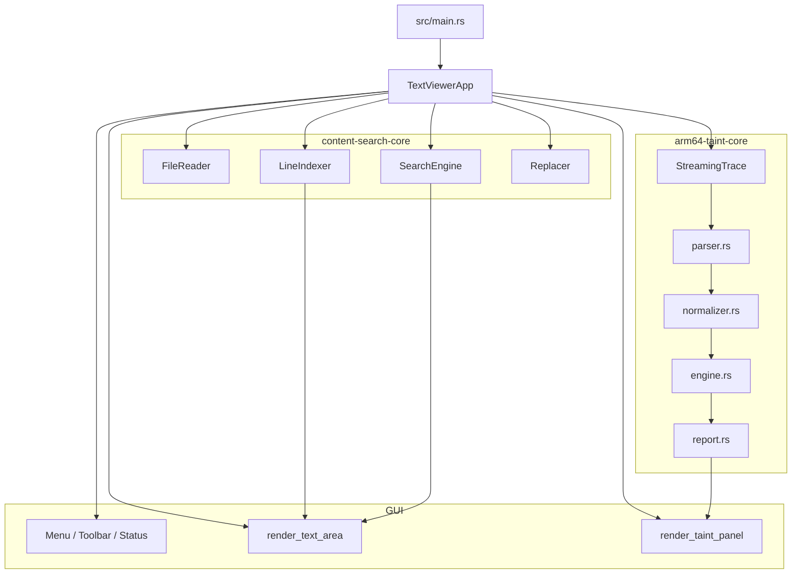
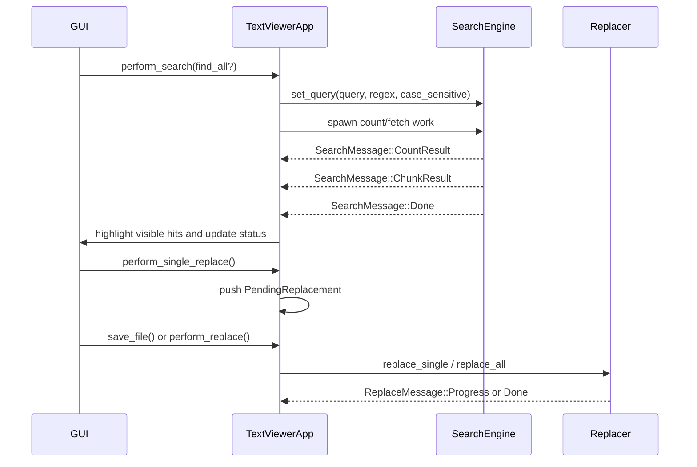
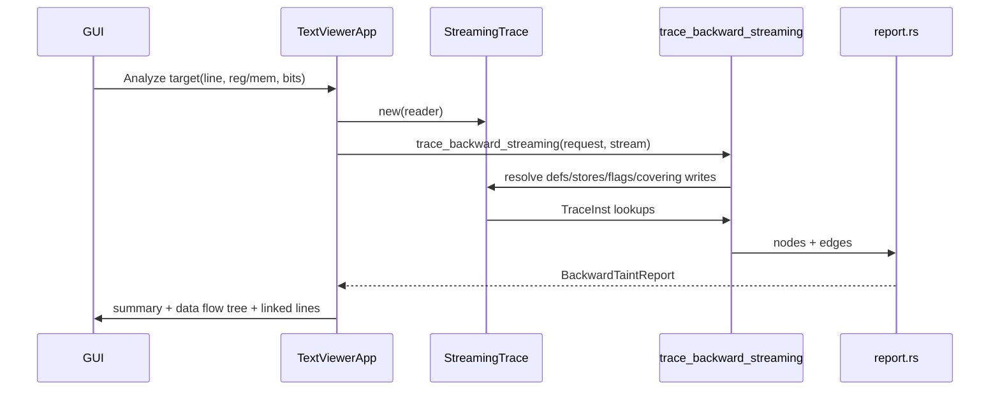

# Taint-Rev-Trace Architecture

## Overview

This repository is a Rust workspace centered on two cooperating subsystems:

- a large-file viewer stack for mmap-based trace browsing
- an ARM64 backward source tracing stack for taint-style provenance analysis

The GUI is the orchestration layer. It opens large files, renders only the visible viewport, dispatches search and replace work to background threads, and invokes the taint engine against the currently opened trace file.

## Workspace Components

### `content-search`

- Binary crate rooted at `src/main.rs`
- Starts the `eframe` window and owns `TextViewerApp`
- Integrates file viewing, search, replace, tail mode, and taint visualization

### `content-search-core`

- `file_reader.rs`: memory-mapped file access plus encoding decoding
- `line_indexer.rs`: full or sparse line indexing
- `search_engine.rs`: background search, result streaming, page fetching
- `replacer.rs`: single replace and streaming replace-all

### `arm64-taint-core`

- `parser.rs`: syntax-level trace line parsing
- `normalizer.rs`: converts raw lines into `TraceInst`
- `indexer.rs`: precomputed lookup structures for non-streaming mode
- `streaming.rs`: chunk-based, on-demand backward lookup for large trace files
- `engine.rs`: backward graph expansion
- `report.rs`: summary, tree, step, chain, and graph report generation

### `arm64-taint-cli`

- Thin CLI wrapper over `arm64-taint-core`
- Emits JSON reports for a given trace file and target

### `trace-search-mcp`

- MCP stdio server binary at `crates/arm64-taint-core/src/bin/trace-search-mcp.rs`
- Exposes a full tool surface for backend-capable GUI workflows:
  - `inspect_content_file`
  - `read_content_lines`
  - `search_content`
  - `replace_content_match`
  - `replace_content_all`
  - `trace_backward`
  - `search_trace_sources`
- Reuses `SearchEngine`, `LineIndexer`, `FileReader`, `Replacer`, `StreamingTrace`, and `trace_backward_streaming`
- Designed for agent workflows that need either direct backend parity with the search executable or a combined search + taint flow

## System Relationships



## GUI Runtime Flow

### Startup

1. `src/main.rs` configures Windows CJK font fallbacks.
2. `eframe::run_native` launches the app.
3. `TextViewerApp::default` initializes state for file access, search, replace, and taint UI.

### Open File

1. `render_menu_bar` opens a file dialog.
2. The first bytes are sampled to detect encoding.
3. `TextViewerApp::open_file` builds a `FileReader`.
4. `LineIndexer::index_file_cached` first attempts to load a serialized line index cache and otherwise creates either:
   - a full newline offset table for files up to 10 MB
   - sparse checkpoints plus average line length for larger files
5. Search and taint state are reset against the newly opened file.
6. If tail mode is enabled, `notify` starts watching the file for reloads.

### Viewport Rendering

1. `render_text_area` calculates visible rows from available height and font metrics.
2. `egui::ScrollArea::show_rows` requests only the visible row range.
3. For each row:
   - the app resolves byte offsets through `LineIndexer`
   - bytes are read from `FileReader`
   - text is decoded on demand
   - pending replacements are applied virtually
   - search highlights are layered in
   - taint target lines and graph-linked lines are highlighted
   - register and memory tokens are detected for quick tracing
4. Right-click actions on tokenized text can launch taint analysis directly.

## Search And Replace Flow



### Search Design Notes

- `SearchEngine` compiles both literal and regex search into a regex-backed matcher.
- `Find All` runs two background tasks:
  - total count across parallel chunks
  - first result page fetch
- Search results are streamed through bounded channels to avoid unbounded memory growth.
- Additional pages are fetched on demand through `fetch_page`.

### Replace Design Notes

- Single replace is intentionally staged in memory first.
- Saving to the original file uses repeated `replace_single` calls.
- Replace-all streams input to a new output file and reports progress back to the UI.

## Backward Taint Flow



### Parser And Normalizer

- `parser.rs` accepts multiple trace line formats and only performs syntax splitting.
- `normalizer.rs` converts those raw lines into `TraceInst`.
- Normalized instructions carry:
  - mnemonic and operands
  - destination and source registers
  - memory read and write metadata
  - immediate values
  - shift and condition metadata
  - register value annotations from the trace

### Streaming Lookup Layer

`StreamingTrace` exists so the GUI can analyze large traces without first materializing the whole trace as `Vec<TraceInst>`.

It provides the engine with a `TraceSource` abstraction:

- `get_inst_at_line`
- `find_reg_def`
- `find_store`
- `find_flag_def`
- `find_covering_writes`
- version and value lookups

Implementation characteristics:

- line offsets are discovered lazily and cached
- on-demand parsing is cached per source line
- backward scans read fixed-size chunks from the underlying file
- cheap prefilters reduce unnecessary full parse attempts
- scan distance is capped by `MAX_SCAN_LINES`

### Engine Layer

`engine.rs` builds a backward DAG, not a forward taint bitmap.

Core behavior:

- start from a register slice or memory slice target
- find the most recent defining instruction or store
- expand instruction semantics into one or more source nodes
- assign `Confidence` to each edge
- stop expansion on:
  - immediates
  - static roots
  - arguments
  - return values
  - pre-trace memory
  - typed unknowns
  - depth or node budget exhaustion

Instruction-specific modeling already covers important ARM64 cases such as:

- `mov`, `movz`, `movn`, `movk`
- arithmetic and logical ops
- loads and stores
- `csel`
- `adrp + add`
- call-return via `bl`
- byte-level memory coverage across multiple stores
- upper-half zeroing after `wN` writes

### Report Layer

`report.rs` derives several views from the graph:

- `summary`: counts and top-level health indicators
- `data_flow`: recursive UI-friendly tree
- `graph`: full node and edge list
- `steps`: grouped instruction-centric explanation
- `chains`: linear source chains for readable traversal

The GUI primarily renders `summary` and `data_flow`, while the CLI can serialize the full report to JSON. The MCP server now spans both narrow agent-oriented summaries and fuller backend operations: file stats, line reads, paged search, replace workflows, standalone taint, and grouped search + taint source summaries.

## Public Interfaces With High Change Impact

### Stable Core Interfaces

- `content_search_core::file_reader::FileReader`
- `content_search_core::line_indexer::LineIndexer`
- `content_search_core::search_engine::SearchEngine`
- `content_search_core::replacer::Replacer`
- `arm64_taint_core::BackwardTaintRequest`
- `arm64_taint_core::BackwardTaintOptions`
- `arm64_taint_core::BackwardTaintReport`
- `arm64_taint_core::StreamingTrace`
- `arm64_taint_core::trace_backward`
- `arm64_taint_core::trace_backward_streaming`
- `arm64_taint_core::report_to_json`
- `arm64_taint_core` bin `trace-search-mcp` as the MCP entrypoint for search, replace, line-read, and taint workflows

### Where To Change What

- Trace format support: `parser.rs`, `normalizer.rs`
- Backward slicing semantics: `engine.rs`
- Report shape and UI presentation model: `report.rs`
- Large-file behavior and lookup caching: `streaming.rs`, `line_indexer.rs`, `file_reader.rs`
- Search and replace UX: `search_engine.rs`, `replacer.rs`, `src/app.rs`
- Menu, shortcuts, taint panel, quick actions: `src/app.rs`

## Current Assumptions And Boundaries

- The taint subsystem is backward provenance tracing over recorded execution, not traditional forward taint propagation.
- The GUI taint path uses `StreamingTrace` by default.
- Streaming lookup depends on chunked backward scans and a finite scan window, currently `MAX_SCAN_LINES = 50_000`.
- Full correctness for data-flow answers depends on trace quality:
  - missing register annotations
  - missing memory metadata
  - unsupported opcodes
  - incomplete trace capture
  can all degrade confidence or produce typed unknown roots.

## Validation Baseline

Verified in this repository state with:

```bash
cargo test --workspace
```

Current passing baseline:

- `arm64-taint-core`: 27 tests
- `content-search-core`: 12 tests

These tests provide the minimum regression fence for future refactors of parser, normalizer, engine, report generation, sparse indexing, search, and replace behavior.
